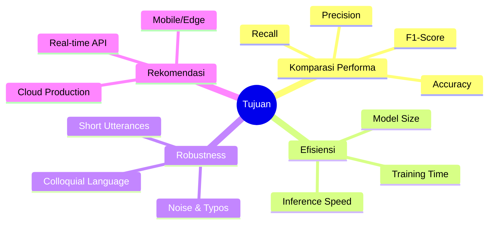

<div align="center">

<!-- ANIMATED HEADER BANNER -->


<br/>

<!-- BADGES ROW 1 -->


<br/><br/>

<!-- BADGES ROW 2 -->


<br/><br/>

> **🎓 Penelitian Komparatif** — Membandingkan 3 paradigma Machine Learning untuk Intent Classification pada Customer Support Chatbot: Classical ML, Deep Learning, dan State-of-the-art Transformer.

</div>

---

## 📋 Daftar Isi

| # | Bagian |
|---|--------|
| 1 | [🔥 Permasalahan](#-permasalahan) |
| 2 | [🎯 Tujuan Penelitian](#-tujuan-penelitian) |
| 3 | [🗄️ Dataset](#️-dataset) |
| 4 | [⚙️ Tech Stack](#️-tech-stack) |
| 5 | [🏗️ Arsitektur Model](#️-arsitektur-model) |
| 6 | [📊 Hasil & Akurasi](#-hasil--akurasi) |
| 7 | [💡 Analisis & Temuan](#-analisis--temuan) |
| 8 | [🚀 Cara Menjalankan](#-cara-menjalankan) |
| 9 | [📁 Struktur File](#-struktur-file) |

---

## 🔥 Permasalahan

<table>
<tr>
<td width="60%">

### 🧩 Konteks Masalah

Customer Support Chatbot modern harus mampu **memahami maksud (intent)** dari pesan pelanggan secara akurat dan real-time.

Tantangannya?

- 💬 Pelanggan menulis dengan gaya berbeda-beda (formal, santai, typo)
- 🗂️ Ada **27 jenis intent** yang harus dibedakan
- ⚡ Harus cepat → pelanggan tidak mau nunggu lama
- 🎯 Harus akurat → salah intent = jawaban yang salah

</td>
<td width="40%">

### ❓ Pertanyaan Penelitian

```
Dari 3 pendekatan ML ini:
  ⚡ Naive Bayes (Classical ML)
  🧠 LSTM       (Deep Learning)
  🚀 BERT       (Transformer)

Mana yang paling:
  ✅ Akurat?
  ✅ Cepat?
  ✅ Efisien?
  ✅ Cocok untuk production?
```

</td>
</tr>
</table>

---

## 🎯 Tujuan Penelitian



---

## 🗄️ Dataset

<div align="center">

### 📦 Bitext Customer Support Dataset

</div>

```
📥 Source   : Kaggle — bitext/training-dataset-for-chatbots-virtual-assistants
📊 Size     : 21,534 utterances
🏷️ Intents  : 27 unique intents
🗂️ Categories: 11 categories
🌍 Language : English
```

### 🔀 Data Split

| Split | Samples | Persentase |
|-------|---------|-----------|
| 🟦 Train | 15,073 | 70% |
| 🟨 Validation | 3,230 | 15% |
| 🟥 Test | 3,231 | 15% |
| **Total** | **21,534** | **100%** |

### 🏷️ 27 Intent Categories

<details>
<summary><b>👆 Klik untuk lihat semua intent</b></summary>

| # | Intent | Category |
|---|--------|----------|
| 1 | `cancel_order` | 📦 ORDER |
| 2 | `change_order` | 📦 ORDER |
| 3 | `check_cancellation_fee` | 📦 ORDER |
| 4 | `track_order` | 📦 ORDER |
| 5 | `place_order` | 📦 ORDER |
| 6 | `get_refund` | 💰 REFUND |
| 7 | `check_refund_policy` | 💰 REFUND |
| 8 | `return_item` | 💰 REFUND |
| 9 | `check_invoice` | 🧾 INVOICE |
| 10 | `get_invoice` | 🧾 INVOICE |
| 11 | `check_payment_methods` | 💳 PAYMENT |
| 12 | `payment_issue` | 💳 PAYMENT |
| 13 | `contact_human_agent` | 👤 CONTACT |
| 14 | `contact_customer_service` | 👤 CONTACT |
| 15 | `create_account` | 🔐 ACCOUNT |
| 16 | `delete_account` | 🔐 ACCOUNT |
| 17 | `edit_account` | 🔐 ACCOUNT |
| 18 | `recover_password` | 🔐 ACCOUNT |
| 19 | `registration_problems` | 🔐 ACCOUNT |
| 20 | `switch_account` | 🔐 ACCOUNT |
| 21 | `delivery_options` | 🚚 DELIVERY |
| 22 | `delivery_period` | 🚚 DELIVERY |
| 23 | `complaint` | 📣 FEEDBACK |
| 24 | `review` | 📣 FEEDBACK |
| 25 | `newsletter_subscription` | 📧 SUBSCRIPTION |
| 26 | `change_shipping_address` | 📍 SHIPPING |
| 27 | `set_up_shipping_address` | 📍 SHIPPING |

</details>

### 🔤 Linguistic Flags in Dataset

> Dataset ini kaya karena mengandung variasi linguistik yang realistis:

| Flag | Deskripsi |
|------|-----------|
| `B` | Basic utterance |
| `C` | Colloquial / informal language |
| `W` | Typos & misspellings |
| `K` | Keyword-only |
| `I` | Interrogative |
| `P` | Polite tone |

---

## ⚙️ Tech Stack

<div align="center">

| Layer | Technology |
|-------|-----------|
| 🐍 Language | Python 3.10+ |
| 🔢 Data | `pandas` `numpy` |
| 📝 NLP Preprocessing | `nltk` `re` |
| 🤖 Classical ML | `scikit-learn` — TF-IDF + MultinomialNB |
| 🧠 Deep Learning | `TensorFlow 2.x` / `Keras` — Bidirectional LSTM |
| 🚀 Transformer | `HuggingFace Transformers` — DistilBERT |
| 📊 Visualization | `matplotlib` `seaborn` `wordcloud` |
| ☁️ Platform | Google Colab (GPU) |
| 📦 Dataset | `kaggle` API |

</div>

---

## 🏗️ Arsitektur Model

### 1️⃣ Naive Bayes — Classical ML

```
Input Text
    │
    ▼
┌─────────────────────────────┐
│     Text Preprocessing       │
│  lowercase + remove special  │
└─────────────┬───────────────┘
              │
              ▼
┌─────────────────────────────┐
│      TF-IDF Vectorizer       │
│  max_features = 5,000        │
│  ngram_range  = (1, 2)       │
│  min_df = 2 | max_df = 0.95  │
└─────────────┬───────────────┘
              │
              ▼
┌─────────────────────────────┐
│    MultinomialNB Classifier  │
│    alpha (smoothing) = 0.1   │
└─────────────┬───────────────┘
              │
              ▼
         27 Intent Classes
```

### 2️⃣ LSTM — Deep Learning

```
Input Sequence (max_len=50)
    │
    ▼
┌──────────────────────────────────┐
│   Embedding Layer                 │
│   vocab=10,000 | dim=128         │
└──────────────┬───────────────────┘
               │
               ▼
┌──────────────────────────────────┐
│   Bidirectional LSTM (128 units) │
│   return_sequences = True        │
└──────────────┬───────────────────┘
               │
          Dropout (0.3)
               │
               ▼
┌──────────────────────────────────┐
│   Bidirectional LSTM (64 units)  │
│   return_sequences = False       │
└──────────────┬───────────────────┘
               │
          Dropout (0.3)
               │
               ▼
┌──────────────────────────────────┐
│   Dense (128, activation=relu)   │
└──────────────┬───────────────────┘
               │
          Dropout (0.3)
               │
               ▼
┌──────────────────────────────────┐
│   Dense (27, activation=softmax) │
└──────────────┬───────────────────┘
               │
               ▼
          27 Intent Classes
```

> **Training Config:** Adam (lr=0.001) · EarlyStopping (patience=5) · ReduceLROnPlateau · Batch=32 · Max Epochs=30

### 3️⃣ DistilBERT — Transformer

```
Input Text (max_len=128 tokens)
    │
    ▼
┌──────────────────────────────────────┐
│   DistilBERT Tokenizer                │
│   [CLS] token1 token2 ... [SEP]      │
└──────────────┬───────────────────────┘
               │
               ▼
┌──────────────────────────────────────┐
│   DistilBERT Base Uncased             │
│   6 Transformer layers               │
│   12 attention heads                 │
│   Hidden size: 768                   │
│   Parameters: 66M                    │
└──────────────┬───────────────────────┘
               │
           [CLS] Token
               │
               ▼
┌──────────────────────────────────────┐
│   Classification Head                 │
│   Linear(768 → 27)                   │
└──────────────┬───────────────────────┘
               │
               ▼
          27 Intent Classes
```

> **Training Config:** HuggingFace Trainer · Fine-tuning · Batch=16 · Epochs=3 · Warmup Steps=500

---

## 📊 Hasil & Akurasi

### 🏆 Final Leaderboard

<div align="center">

| Rank | Model | Accuracy | Precision | Recall | F1-Score |
|------|-------|:--------:|:---------:|:------:|:--------:|
| 🥇 **1st** | **BERT (DistilBERT)** | **`99.88%`** | **`99.88%`** | **`99.88%`** | **`99.88%`** |
| 🥈 **2nd** | **LSTM (BiLSTM)** | `99.54%` | `99.55%` | `99.54%` | `99.54%` |
| 🥉 **3rd** | **Naive Bayes** | `99.35%` | `99.39%` | `99.35%` | `99.35%` |

</div>

### ⚡ Efficiency Comparison

<div align="center">

| Model | Training Time | Inference Speed | Winner |
|-------|:------------:|:---------------:|:------:|
| ⚡ Naive Bayes | `0.02 seconds` | `0.0017 ms/sample` | 🥇 Tercepat |
| 🧠 LSTM | `3.75 minutes` | `0.3969 ms/sample` | 🥈 Menengah |
| 🚀 BERT | `10.65 minutes` | `3.4944 ms/sample` | 🥉 Terlambat |

</div>

### 📈 Accuracy Visual

```
Accuracy (%)   99.0    99.2    99.4    99.6    99.8    100.0
               │       │       │       │       │       │
Naive Bayes    ████████████████████████████████░░░░░░  99.35%
               │
LSTM           ████████████████████████████████████░░  99.54%
               │
BERT           ████████████████████████████████████████ 99.88%
```

```
Inference Speed (ms/sample) — Lower is Better
               0.0     1.0     2.0     3.0     4.0
               │       │       │       │       │
Naive Bayes    █  0.0017ms  ← 2000x faster than BERT
               │
LSTM           ████  0.397ms  ← 8x faster than BERT
               │
BERT           ██████████████████  3.494ms
```

### 🎯 Per-Intent Best Model

<details>
<summary><b>👆 Klik untuk lihat dominasi per-intent</b></summary>

| Model | Jumlah Intent Terbaik | Intent Unggulan |
|-------|:---------------------:|-----------------|
| 🔴 Naive Bayes | **14 intents** | change_shipping_address, check_cancellation_fee, contact_human_agent, contact_customer_service, create_account ... |
| 🟢 LSTM | **4 intents** | cancel_order, change_order, review, place_order |
| 🟡 BERT | **9 intents** | check_payment_methods, complaint, delivery_period, delete_account, track_order ... |

</details>

---

## 💡 Analisis & Temuan

### 🔑 Key Findings

> **Finding 1 — Accuracy Gap Kecil**
> Perbedaan accuracy antara Naive Bayes (99.35%) dan BERT (99.88%) hanya **0.53%** — sangat kecil untuk gap sekompleks 3 paradigma ML yang berbeda!

> **Finding 2 — Efisiensi Dramatic**  
> Naive Bayes **2000x lebih cepat** dari BERT untuk inference, dengan training hanya **0.02 detik** vs **10.65 menit**.

> **Finding 3 — Dataset Bersih = Semua Model Bagus**  
> Semua model mencapai >99% karena dataset Bitext berkualitas tinggi dan well-structured. Pada data real-world yang noisier, gap antar model akan lebih terlihat.

### 🚀 Deployment Recommendations

```
┌─────────────────────────────────────────────────────────┐
│              📱 MOBILE / EDGE DEPLOYMENT                  │
│   Resource terbatas? Gunakan ► Naive Bayes               │
│   Training: 0.02s | Inference: 0.0017ms | Accuracy: 99%  │
└─────────────────────────────────────────────────────────┘

┌─────────────────────────────────────────────────────────┐
│              ⚖️  BALANCED PRODUCTION                     │
│   Mau akurasi + kecepatan? Gunakan ► LSTM                │
│   Training: 3.75min | Inference: 0.4ms | Accuracy: 99.5% │
└─────────────────────────────────────────────────────────┘

┌─────────────────────────────────────────────────────────┐
│              ☁️  CLOUD / HIGH-ACCURACY                   │
│   Perlu akurasi maksimal? Gunakan ► BERT                 │
│   Training: 10.65min | Inference: 3.5ms | Accuracy: 99.9%│
└─────────────────────────────────────────────────────────┘
```

### ⚠️ Keterbatasan Penelitian

- Dataset Bitext sangat clean → hasil mungkin lebih rendah di data dunia nyata
- Eksperimen dilakukan di Google Colab (GPU T4) — waktu training bisa berbeda
- Belum ada uji robustness pada code-switching (Bahasa Indonesia + Inggris)
- BERT tidak di-fine-tune dari scratch — menggunakan pre-trained weights

---

## 🚀 Cara Menjalankan

### ☁️ Google Colab (Recommended)

```
1. Buka file .ipynb di Google Colab
2. Runtime → Change runtime type → GPU (T4)
3. Jalankan cell pertama untuk install dependencies
4. Upload kaggle.json saat diminta
5. Run All!
```

### 💻 Local Setup

```bash
# Clone repository
git clone https://github.com/username/intent-classification-comparison.git
cd intent-classification-comparison

# Install dependencies
pip install -r requirements.txt

# Download NLTK data
python -c "import nltk; nltk.download('punkt'); nltk.download('stopwords')"

# Setup Kaggle API
mkdir ~/.kaggle
cp kaggle.json ~/.kaggle/
chmod 600 ~/.kaggle/kaggle.json

# Download dataset
kaggle datasets download -d bitext/training-dataset-for-chatbotsvirtual-assistants
unzip training-dataset-for-chatbotsvirtual-assistants.zip -d bitext_data

# Run notebook
jupyter notebook intent_classification_comparison.ipynb
```

### 📦 Requirements

```txt
tensorflow>=2.10
transformers>=4.30
datasets>=2.12
scikit-learn>=1.2
pandas>=1.5
numpy>=1.23
nltk>=3.8
matplotlib>=3.6
seaborn>=0.12
wordcloud>=1.9
kaggle>=1.5
```

---

## 📁 Struktur File

```
📦 intent-classification-comparison/
├── 📓 intent_classification_comparison.ipynb   ← Main notebook
├── 📄 README.md                                 ← You are here!
├── 📋 requirements.txt                          ← Dependencies
│
├── 📊 results/
│   ├── model_comparison_results.csv             ← Tabel perbandingan
│   ├── per_intent_comparison.csv                ← F1 per intent
│   └── experiment_results.json                  ← Raw results
│
├── 🖼️ figures/
│   ├── model_comparison_visualization.png       ← Bar chart perbandingan
│   ├── confusion_matrices_comparison.png        ← Confusion matrices
│   └── model_dominance.png                      ← Dominasi per intent
│
└── 💾 saved_models/
    ├── naive_bayes_model.pkl                    ← Naive Bayes
    ├── tfidf_vectorizer.pkl                     ← TF-IDF vectorizer
    ├── best_lstm_model.h5                       ← LSTM weights
    ├── lstm_tokenizer.pkl                       ← LSTM tokenizer
    ├── final_bert_model/                        ← DistilBERT fine-tuned
    └── label_encoder.pkl                        ← Label encoder
```

---

<div align="center">

### 📊 Quick Stats


<br/>

**Made with ❤️ for NLP Research**


</div>
